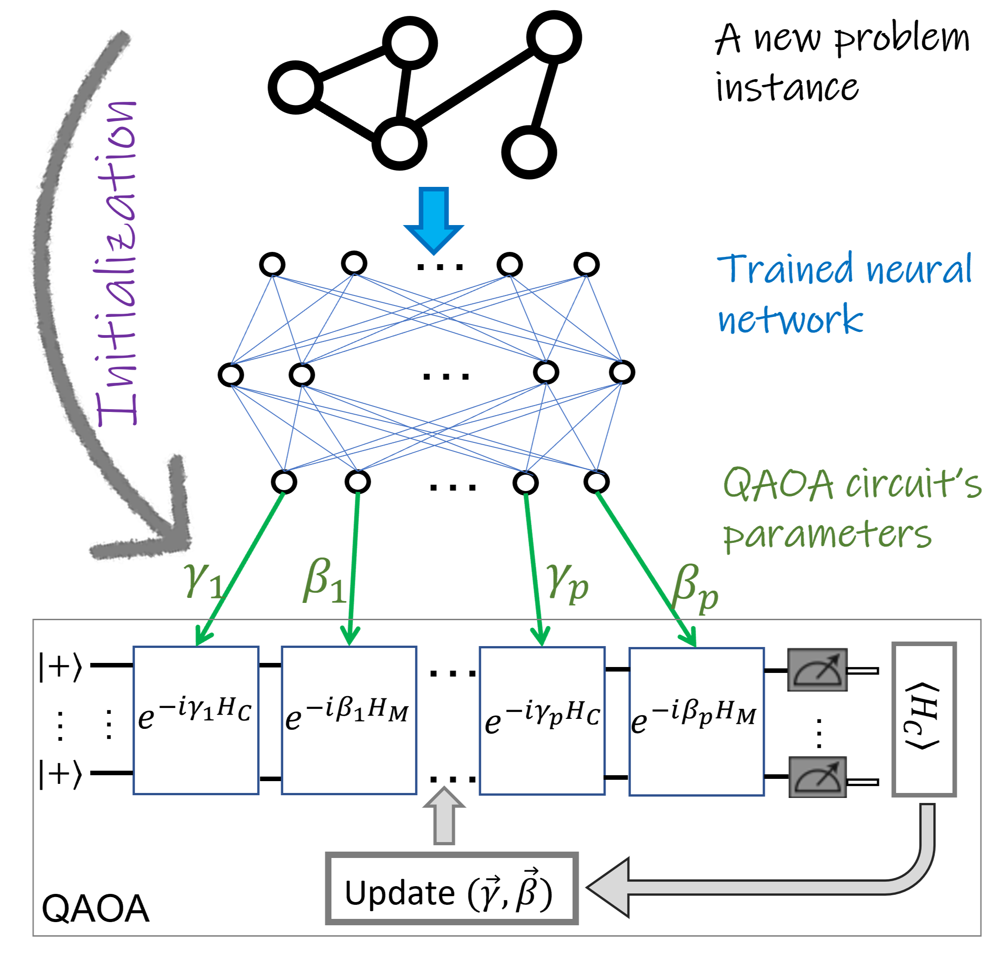

## Iterative-Free Quantum Approximate Optimization Algorithm Using Neural Networks
This is an official implementation of ***Iterative-Free Quantum Approximate Optimization Algorithm Using Neural Networks*** paper. [[Link]](https://amosy3.github.io/papers/QAOA_init.pdf)

<center>

</center>
  

#### Installation
- Run: ```pip install -r requirements.txt```


#### Create train dataset
- Run: ```python maxcut_data_generator.py -n 14 -p 2 -prob 0.3 0.9```

#### Create test dataset
- Run: ```python generate_test_dataset.py -n 14 -p 2 -prob 0.3 0.9```

#### Train neural network
- Run: ```python train_network.py  -n 14 -p 2 --csv_path "<train_file_path>" ```


#### Citation

If you find this repository to be useful in your own research, please consider citing the following paper:

```bib
@article{amosy2022iterative,
  title={Iterative-Free Quantum Approximate Optimization Algorithm Using Neural Networks},
  author={Amosy, Ohad and Danzig, Tamuz and Porat, Ely and Chechik, Gal and Makmal, Adi},
  journal={arXiv preprint arXiv:2208.09888},
  year={2022}
}
```
